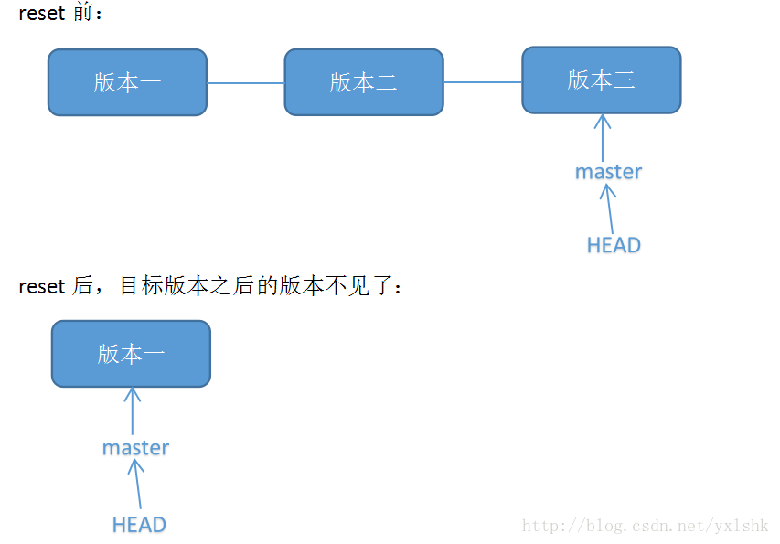
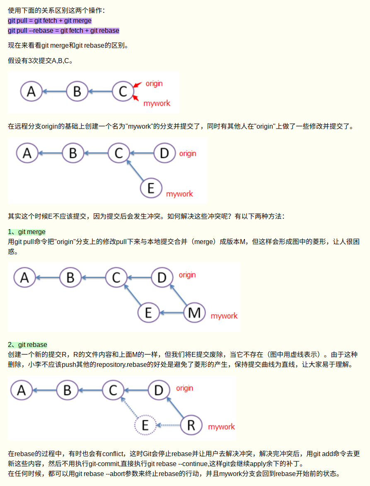
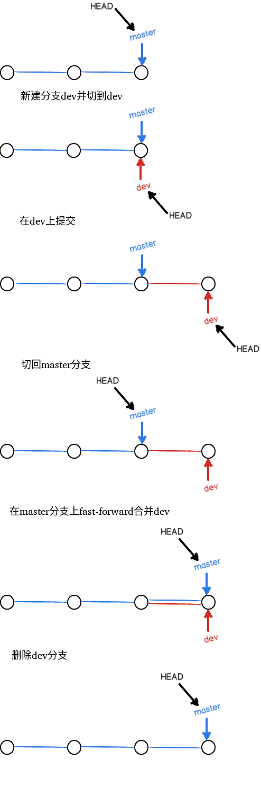
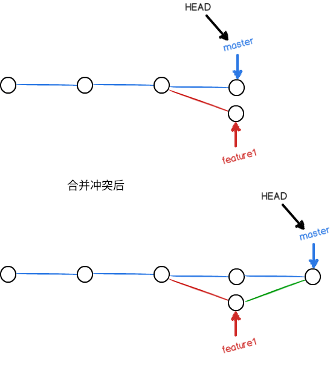
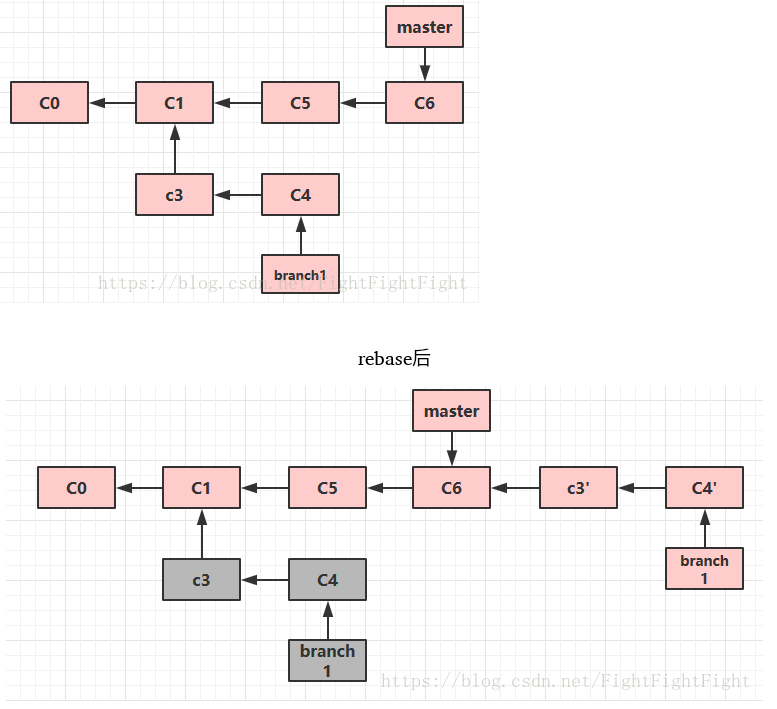
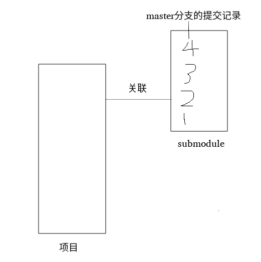

# git note

这是我学习git过程中记录的笔记,方便我自己查找git命令和功能,如果没有任何git基础想通过这篇笔记学习git可能会有很大难度,建议在网上找那些带练习的git教程学习,多练习多思考,才能理解git

这篇笔记最早是看廖雪峰git教程时做的笔记,都是最常使用到的git知识,后来在工作中发现这些知识不够用了,又加入了一些新学习到的git知识,同时把在查找资料中看到的不那么常用的git知识也摘抄下来

在查找资料的过程中,我发现git的功能太强大了,完全精通的知识量应该不亚于精通一门数据库.我觉得作为一个保存代码版本的工具没必要花太多精力学习git的每一个功能,这里只记录基本的用法,遇到不常见的操作搜索解决吧


## 约定

字段前带~~符号或者<>括起来的文字的都是需要按自己情况填写的


## 结构

工作区--add-->暂存区--commit-->版本分支


## git安装

```shell
sudo apt-get install git
```


## 安装后的设置

```shell
git config --global user.name "~~YourName"
git config --global user.email "~~email@example.com"
```

> --global	代表全局参数,也就是这些配置在这台电脑的所有Git仓库下都有用,如果不加,那只针对当前的仓库起作用

查看git配置

```shell
git config --list
```

> --global	查看全局的
>
> --local	查看当前的


## 初始化目录和第一次提交

将当前目录初始化为git可以管理的目录（创建了一个.git目录）

```shell
git init
```

> --git-dir=~~path	设置初始化仓库的路径,不加就为当前目录
>
> --bare	将仓库初始化为裸仓库.不加--bare时会在初始化目录生成一个.git文件夹,里面记录了当面仓库的配置和版本,加--bare时,初始化目录里所有文件就是.git文件夹下的文件,用户不能在这个目录下进行git操作.这个选项的目的是为了生成一个不允许操作的远程仓库.加--bare初始化的目录可以在目录名后加.git,从这个目录clone的项目目录名后不会加上.git

将文件~~filename从工作区提交到暂存区

```shell
git add ~~filename
```

> git add -u：将文件的修改、文件的删除，添加到暂存区。
> git add .：将文件的修改，文件的新建，添加到暂存区。
> git add -A：将文件的修改，文件的删除，文件的新建，添加到暂存区。

将暂存区文件提交到版本分支（未加入到暂存区的不能提交到当前分支）

```shell
git commit -m "description"
```

> -a	自动将被修改或被删除的文件加入到暂存区后提交,**但是不会track新创建的文件**


## 查看仓库状态和文件被修改内容

查看仓库状态

```shell
git status
```

查看工作区文件内容和最后加入到暂存区的版本的内容的不同

```shell
git diff ~~filename
```

查看暂存区文件内容和版本分支文件内容的不同

```shell
git diff --cached
#或者
git diff --staged
```

查看文件和版本分支里的文件的区别

```shell
git diff HEAD -- ~~filename
```


## 查看提交日志

查看提交历史记录

```shell
git log
```

可选参数

> -n		n为数字,显示最后n此记录日志
>
> --pretty=oneline	每条记录只显示一行
>
> --abbrev-commit	commit id缩写,只显示前7位
>
> --oneline	等于--pretty=oneline加--abbrev-commit
>
> -p		显示每次提交的差异

显示对repository所做的每一条操作记录,可以显示commit id,如果不小心回退到老版本,可以通过这条命令找到新版本的commit id

```shell
git reflog
```

查看最后一次提交

```shell
git last
```


## 版本回退



将暂存区和工作区中内容回退到版本分支中的版本

```shell
git reset --hard HEAD
```

> HEAD代表最新提交的版本
>
> HEAD^代表上个版本
>
> HEAD^^代表上上个版本
>
> 回退的版本太长，比如往上100个版本，可以用HEAD~100表示
>
> 回退后,如果想还原到回退前的最新版本,可以找到之前最新版本的commit号,用reset回退
>
> git reset --hard ~~commitid
>
> 回退单个文件
>
> git reset HEAD ~~filename


## 版本反做


将暂存区和工作区中内容回退到版本分支中的版本,但会生成一个新的提交

```shell
git revert -n ~~版本号
```

可能会出现冲突,需要手动修改冲突的文件再git add,git commit

如果版本号是一个merge的提交,会出现

> error: commit ~~merge提交的版本号 is a merge but no -m option was given.
>
> fatal: revert failed

这是因为你revert的那个commit是一个merge commit,它有两个parent,Git不知道base是选哪个parent,就没法diff,所以就抱怨了,所以你要显示告诉Git用哪一个parent

通过git log查看merge的提交日志,可以看到合并的两个分支的commit id,然后执行

```shell
git revert -n ~~mergecommitid -m ~~n
```

> ~~n为1或2,代表合并的两个分支的commit id


## 撤销修改

让工作区的文件内容恢复为暂存区中的文件内容

```shell
git checkout -- ~~filename
```

> 如果没有--,就变成切换到另一个分支了,但是如果当前仓库没有名为~~filename的分支,也可以不加--

如果修改内容已经提交到暂存区了,就要使用git reset HEAD了


## 删除文件

如果在工作区中把文件删除了,也想把版本分支中的文件也删除,执行:

```shell
git rm ~~filename
git commit -m "description"
```

**如果工作区中文件没删除,git rm会删除工作区中的文件**

> --cached		仅把文件从暂存区中删除,工作区中还存在
>
> -r			递归删除文件夹
>
> -n,--dry-run	看一下会删除哪些文件,并不会有真的删除操作

### 删除新加文件

git clean从工作目录中删除所有没有tracked过的文件,但git clean不能直接用,必须加参数,参数如下:

> -n	提示哪些文件会被删除,不会真的删除
>
> -dn	提示哪些文件夹会被删除,不会真的删除
>
> -f	删除当前目录下所有没有track过的文件,不会删除.gitignore文件里面指定的文件夹和文件, 不管这些文件有没有被track过
>
> -f <path>	删除指定路径下的没有被track过的文件
>
> -df	删除当前目录下没有被track过的文件和文件夹
>
> -xf	删除当前目录下所有没有track过的文件. 不管他是否是.gitignore文件里面指定的文件夹和文件


## 远程仓库

本机生成ssh公私钥

```shell
ssh-keygen -t rsa -C "~~youremail@example.com"
```

把本地仓库和GitHub仓库关联

```shell
git remote add origin ~~git@github.com:michaelliao/learngit.git
```

> 添加后,远程库的名字就是origin,这是Git默认的叫法,也可以改成别的,但是origin这个名字一看就知道是远程库

将当前分支master推送到远程

```shell
git push -u origin master
```

> -u	把本地master分支和远程master分支关联起来,第一次push时需要加这个参数

完整git push命令

```shell
git push <远程主机名> <本地分支名>:<远程分支名>
```

不过我们一般使用省略写法

将本地版本库推送到GitHub

```shell
git push origin master
git push origin dev
```

**git push只会把已加入版本分支的代码提交到服务器,暂存区和工作区的代码不会提交**

> -f	**不能用!!!**强制推送,如果本地仓库和远程仓库push有冲突,比如pull后有其他人向远程仓库push了,在本地commit,push时会报错,可以用-f把别人的push覆盖掉.**不能用!!!应该再次pull代码解决冲突后commit,push**

设置push.default

```shell
git config --global push.default matching
#或者
git config --global push.default simple
```

> 当 push.default 设置为 'matching' 后，git 将推送和远程同名的所有
> 本地分支。
>
> 从 Git 2.0 开始，Git 默认采用更为保守的 'simple' 模式，只推送当前
> 分支到远程关联的同名分支，即 'git push' 推送当前分支。
>
> （'simple' 模式由 Git 1.7.11 版本引入。如果您有时要使用老版本的 Git，
> 为保持兼容，请用 'current' 代替 'simple'）

从远程仓库拉代码

```shell
git fetch <远程主机名> <分支名>
```

和git push一样,我们一般使用省略写法

git fetch后我们还是在之前分支上,代码并没有改变,但我们会获得一个FETCH_HEAD,这个提交指向远程仓库最新的提交,要想更新到远程服务器上的最新代码需要

```shell
git merge FETCH_HEAD
#或者
git merger origin ~~分支名
```

把服务器代码拉到本地,完整git pull命令

```shell
git pull <远程主机> <远程分支>:<本地分支>
```

和git push一样,我们一般使用省略写法

直接使用

```shell
git pull
```

会把服务器上所有分支新代码拉到本地,而直接用

```shell
git push
```

并不会把本地所有分支的更改推送到服务器,只会把当前分支的更改推送到服务器

**git pull=git fetch + git merge**

**git pull --rebase=git fetch + git rebase**

解决完冲突后记得git add,commit.

两者区别如下:



将GitHub上的库克隆到本地

```shell
git clone ~~git@github.com:michaelliao/gitskills.git
```

**也可以从本地一个被初始化的目录clone**

查看远程仓库信息

```shell
git remote
```

> -v	显示更详细的信息

默认只会克隆master分支，创建origin的dev分支到本地

```shell
git checkout -b dev origin/dev
```


## 分支管理

### 分支创建与合并

创建新分支

```shell
git checkout -b dev
```

> -b参数表示创建并切换,上面命令相当下面两条命令
>
> git branch dev
>
> git checkout dev

git checkout其他用法

```shell
#检测版本库中哪些文件有改动,不能检测到新增的文件
git checkout
#将某个文件切换为某个分支的状态
git checkout ~~branch -- ~~filename
#将版本切换到某次提交状态,进入"分离头指针"状态
git checkout ~~commitid
#切到一个以某个分支最后一次commitid为名的分支,不加分支名就是当前分支
git checkout --detach ~~branch
#可以基于某一次commitid创建一个新分支
git checkout -b ~~newbranch ~~commitid
#或
git branch ~~newbranch ~~commitid
git checkout ~~newbranch
#创建一个没有任何提交记录的"分支",这个"分支"中的所有文件都不在版本库中.这个"分支"必须做一次提交才能成为真正的分支.如果某个分支上积累了很多次提交,git checkout --prphan后,在这个新建的分支上没有任何提交
git checkout --orphan ~~newbranch
#将当前分支工作区的内容合并到切换的分支下,如果当前分支有修改,会回退到HEAD,切换到新分支下可能需要解决冲突
git checkout --merge ~~newbranch
#比较当前分支和目标分支之间的差异,并提供交互式界面选择进一步操作(是否替换为目标分支内容)
git checkout -p ~~newbranch
```

>  -f	强制切换,如果在某个分支上修改了某个文件没有commit(在工作区修改或在工作区修改后git add),是无法切换到其他分支的,除非其他分支的那个文件和当前分支的文件相同.使用-f强制切换,**会把当前分支没有commit的内容全部撤销**,所以**不建议使用-f**
>
> -B	强制创建新的分支.直接git check -b是不能创建同名分支,但使用-B可以强制创建并覆盖掉原来的分支

查看当前分支

```shell
git branch
```

当前分支前会有一个*号

> -a	显示本地和远程的分支
>
> -r	显示远程分支
>
> -v	显示分支的详细信息

在dev分支上做修改后,切换到master,合并dev分支

```shell
git checkout master

git merge dev
```

git merge命令用于合并指定分支到当前分支

**默认为Fast forward模式,是直接把master指向dev的当前提交,所以合并速度非常快,fast-forward原理如下**



实际开发中master分支一般不在上面修改，都是在dev分支上，当dev分支修改完成后，再把dev分支合并到master

**禁用Fast forward模式合并,在merge时会在master上生成一个新的commit**

```shell
git merge --no-ff -m "merge with no-ff" dev
```

> -m	后面写commit日志

禁用fast forward模式原理如下所示:


### 删除分支

删除dev分支

```shell
git branch -d dev
```

删除分支后,会丢掉分支信息

如果删除一个未合并的分支，需要加-D选项

```shell
git branch -D ~~branchname
```

删除远程分支

```shell
git branch -d -r ~~branchname
#还需推送到服务器
git push origin:~~branchname
```

### 重命名分支

重命名本地分支

```shell
git branch -m ~~oldbranch ~~newbranch
```

> 重命名远程分支:
>
> 1.删除远程待修改分支
>
> 2.push本地新分支到远程服务器

### 合并冲突

如果在新建的分支feature1上做了修改,也在master分支上做了修改,在master分支上执行

```shell
git merge feature1
```

会报错,提示有冲突.我们这时执行git status也能看到冲突信息,现在要做的就是打开有冲突的文件,手动修改冲突代码后再次add,commit

查看冲突合并情况

```shell
git log --graph --pretty=oneline --abbrev-commit
```

原理如下图所示:



### 临时保存现场

存储工作现场

```shell
git stash
```

会把所有git add后的文件压栈,现在工作区的代码都是HEAD版本的代码(**一定要把新建的文件git add,否则不会被压栈**)

查看保存的工作现场

```shell
git stash list
```

恢复保存的工作现场

```shell
#需要用git stash drop来删除stash内容
git stash apply
#恢复的同时把stash也删除了
git stash pop	
```

可以多次stash，恢复的时候，先用git stash list查看，然后恢复指定的stash

```shell
git stash apply ~~stashlist中的号
```

### 多人协作

如果有人在本地新拉了分支,在这个分支做修改后是不能直接

```shell
git push
```

需要在本地执行

```shell
git push --set-upstream <remotereponame> <newbranch>
```

如果多人对dev分支进行修改，一人在本地git commit,git push后,其他人在本地git commit,git push时会失败,需要先

```shell
git pull
```

把最新的提交从origin/dev上抓下来，在本地合并，解决冲突后再推送，第一次pull时会报错:no tracking information,说明本地分支和远程分支的链接关系没有创建，用命令需要指定本地dev和远程origin/dev分支的链接

```shell
git branch --set-upstream-to=origin/dev dev
git pull
```

git pull时会提示有冲突,打开有冲突的文件,解决冲突后,再git add,git commit,git push

### 变基

把本地未push的分叉提交历史整理成直线,目的是使得我们在查看历史提交的变化时更容易,因为分叉的提交需要三方对比

```shell
git rebase
git log --graph --pretty=oneline --abbrev-commit
```

也可以在两个不同的分支上变基,如果在branch1分支上执行

```shell
git rebase master
```

是把当前分支的修改加入到master的最后的提交上.

变基即改变基地址,找到两个分支最近的共同祖先,根据当前分支(上例中`branch1`)的提交历史生成一系列补丁文件,然后以基地分支最后一个提交为新的提交起始点,应用之前生成的补丁文件,最后形成一个新的合并提交,从而使得变基分支成为基地分支的直接下游

如下图所示




## 子模块

### 克隆带子模块的项目

```shell
git clone /path/to/repos/foo.git
git submodule init
git submodule update
```

推荐用一条命令搞定

```shell
git clone --recursive /path/to/repos/foo.git
```

> --recursive	可以在clone项目时同时clone关联的submodules

**项目只会记录子模块的commit id,子模块需要在项目中git submodule update或者在子模块目录中git pull才能把子模块远程代码拉下来**

### 查看子模块是否被修改

在项目目录执行

```shell
git diff
```

查看子模块最后的commitid和项目记录的子模块最后commitid是否相同

### 查看子模块信息

```shell
git submodule
```

可以看到子模块的hash值和文件目录.刚clone项目代码时,hash值前有一个-号,代表改子模块没有被检出,检出submodule

```shell
git submodule init
git submodule update
#或者直接使用一句
git submodule update --init --recursive
```

可以查看.git/config文件,里面有git仓库子模块的信息

### git submodule update分支问题

git submodule update后子模块的分支不在master上,因为:

> Git对于Submodule有特殊的处理方式，在一个主项目中引入了Submodule其实Git做了3件事情：
>
> - 记录引用的仓库
> - 记录主项目中Submodules的目录位置
> - 记录引用Submodule的**commit id**
>
> 在**project1**中push之后其实就是更新了引用的commit id，然后project1-b在clone的时候获取到了submodule的commit id，然后当执行**git submodule update**的时候git就根据**gitlink**获取submodule的commit id，最后获取submodule的文件，所以clone之后不在任何分支上；

项目中记录的子模块的commit id是和本模块相关的commit id,如下图,项目中使用的submodule中第2次提交的代码,所以在项目目录执行git submodule update会将submodule的第2次提交的代码拉下来生成一个新的分支并切换过去.



如果在子模块目录切换到master分支执行git pull,或者在项目目录执行

```shell
git submodule foreach "git checkout master && git pull"
```

**会将submoduel的master分支的最新代码拉下来,而我们只需要submodule的master分支第2次提交的代码,这就达不到我们的目的了**

所以,git submodule update后子模块分支不在master上是故意这么设计的

### 添加子模块

将远程仓库添加到本地项目作为子模块

```shell
git submodule add ~~远程仓库地址 ~~本地目录
```

> 如果本地目录不存在,会自动创建

### 子模块维护规则

添加子模块后,git status会在本地发现新增加了自己子模块的目录和一个.gitmodule文件,这个文件记录了每个submodule的引用信息,包含子模块在当前仓库的位置和子模块远程仓库的位置,然后需要在项目目录git add,commit,push

修改子模块文件后,需要在子模块所在的目录下git add,commit,push,同时也需要在项目目录git add,commit,push

### 删除子模块

一般教程都是下面的方法

```shell
git rm --cached ~~submodule
rm -rf ~~submodule
#如果只有一个子模块,直接删除.gitmodules文件,如果有多个子模块只删除部分子模块,请修改.gitmodule文件把里面和待删除子模块的内容删除
rm .gitmodules
rm .git/modules/~~submodule
vim .git/config
```

删除submodule相关内容.然后git add,commit,push到远程仓库

后来发现用下面的方法更简单

```shell
git rm ~~submodule
git status
git commit -m "remove submodule"
git push origin master
```

### 遇到的问题记录

git submodule add一个子模块后,如果没有提交,git rm --cached,rm删除这个子模块,然后想再次git submodule add这个子模块,一定要修改.git/config文件,把里面和子模块相关的内容删除,还需要删除.git/modules/子模块名目录,否则再次git submodule add这个子模块时,会报错:

> A git directory for 'libs/lib1' is found locally with remote(s):
>   origin	/home/lzh/test/submd/ws/../repos/lib1
> If you want to reuse this local git directory instead of cloning again from
>   /home/lzh/test/submd/ws/../repos/lib1.git
> use the '--force' option. If the local git directory is not the correct repo
> or you are unsure what this means choose another name with the '--name' option.


## 标签管理

标签就是对某个分支的某次提交起别名,一般起成v1.0,v2.0这样的,方便管理

创建标签

```shell
git tag <标签名> <commit id>
```

> 如果不加commit id,默认当前commit id

创建带备注的标签

```shell
git tag -a <标签名> -m "说明文字" <commit id>
```

查看已打标签

```shell
git tag
```

> 标签不是按时间顺序列出，而是按字母排序

查看某个标签信息

```shell
git show <标签名>
```

**注意:标签总是和某个commit挂钩.如果这个commit既出现在master分支,又出现在dev分支,那么在这两个分支上都可以看到这个标签**
删除标签

```shell
git tag -d <标签名>
```


将标签推送到远程

```shell
git push <远程库名> <标签名>
```

一次性推送全部尚未推送到远程的本地标签

```shell
git push <远程库名> --tags
```

如果标签已经推送到远程,要删除远程标签就麻烦一点

```shell
#先从本地删除
git tag -d <标签名>
#从远程删除
git push <远程库名> :refs/tags/<标签名>
```


## 自定义git

让git显示颜色

```shell
git config --global color.ui true
```

忽略特殊文件

在工作区的根目录下创建.gitignore文件，GitHub已准备了各种配置文件，见：https://github.com/github/gitignore

已忽略的文件强制添加到git

```shell
git add -f <filename>
```

检查文件是否被忽略

```shell
git check-ignore -v <filename>
```

.gitignore应该放在版本库里

配置别名

例子:

```shell
git config --global alias.st status
git config --global alias.co checkout
git config --global alias.ci commit
git config --global alias.br branch
git config --global alias.unstage 'reset HEAD'
git config --global alias.last 'log -1'
```

之后,git st就代表git status

查看提交历史记录例子

```shell
git config --global alias.lg "log --color --graph --pretty=format:'%Cred%h%Creset -%C(yellow)%d%Creset %s %Cgreen(%cr) %C(bold blue)<%an>%Creset' --abbrev-commit"
```

删除别名

```shell
git config --global --unset alias.ci
```

配置别名的配置文件

每个仓库的配置文件在.git/config,里面的[alias]标签下就是别名的配置

当前用户的配置文件在~/.gitconfig


## 参考连接

[廖雪峰Git教程](https://www.liaoxuefeng.com/wiki/0013739516305929606dd18361248578c67b8067c8c017b000)

[简单对比git pull和git pull --rebase的使用](https://www.cnblogs.com/kevingrace/p/5896706.html)

[Git整理(四) git rebase 的使用](https://blog.csdn.net/FightFightFight/article/details/80850328)


