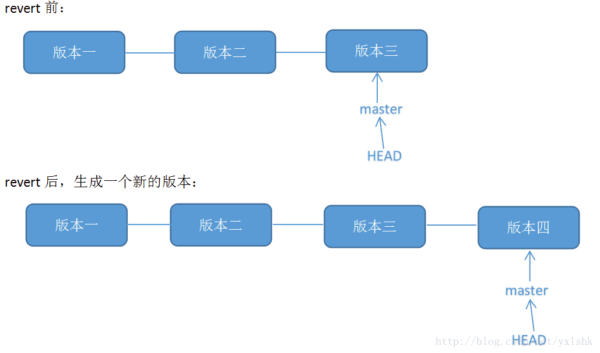

# git note

这是看廖雪峰git教程时做的笔记,然后再加上一些看其他资料做的笔记


## 约定

字段前带~~符号的都是需要按自己情况填写的


## 结构

工作区--add-->暂存区--commit-->版本分支


## git安装

```shell
sudo apt-get install git
```


## 安装后的设置

```shell
git config --global user.name "~~YourName"
git config --global user.email "~~email@example.com"
```

查看git配置

```shell
git config --list
```


## 初始化目录和第一次提交

将当前目录初始化为git可以管理的目录（创建了一个.git目录）

```shell
git init
```

将文件~~filename从工作区提交到暂存区

```shell
git add ~~filename
```

将暂存区文件提交到版本分支（未加入到暂存区的不能提交到当前分支）

```shell
git commit -m "description"
```


## 查看仓库状态和文件被修改内容

查看仓库状态

```shell
git status
```

查看工作区文件内容和最后加入到暂存区的版本的内容的不同

```shell
git diff ~~filename
```

查看暂存区文件内容和版本分支文件内容的不同

```shell
git diff --cached
#或者
git diff --staged
```

查看文件和版本分支里的文件的区别

```shell
git diff HEAD -- ~~filename
```


## 查看提交日志

查看提交历史记录

```shell
git log
```

可选参数

> -n		n为数字,显示最后n此记录日志
>
> --pretty=oneline	每条记录只显示一行
>
> --abbrev-commit	commit id缩写,只显示前7位
>
> --oneline	等于--pretty=oneline加--abbrev-commit

显示对repository所做的每一条操作记录,可以显示commit id,如果不小心回退到老版本,可以通过这条命令找到新版本的commit id

```shell
git reflog
```

查看最后一次提交

```shell
git last
```


## 版本回退


将暂存区和工作区中内容回退到版本分支中的版本

```shell
git reset --hard HEAD
```

> HEAD代表最新提交的版本
>
> HEAD^代表上个版本
>
> HEAD^^代表上上个版本
>
> 回退的版本太长，比如往上100个版本，可以用HEAD~100表示
>
> 回退后,如果想还原到回退前的最新版本,可以找到之前最新版本的commit号,用reset回退
>
> git reset --hard ~~commitid
>
> 回退单个文件
>
> git reset HEAD ~~filename


## 版本反做



将暂存区和工作区中内容回退到版本分支中的版本,但会生成一个新的提交

```shell
git revert -n ~~版本号
```

可能会出现冲突,需要手动修改冲突的文件再git add,git commit

如果版本号是一个merge的提交,会出现

> error: commit ~~merge提交的版本号 is a merge but no -m option was given.
>
> fatal: revert failed

这是因为你revert的那个commit是一个merge commit,它有两个parent,Git不知道base是选哪个parent,就没法diff,所以就抱怨了,所以你要显示告诉Git用哪一个parent

通过git log查看merge的提交日志,可以看到合并的两个分支的commit id,然后执行

```shell
git revert -n ~~mergecommitid -m ~~n
```

> ~~n为1或2,代表合并的两个分支的commit id


## 撤销修改

让工作区的文件内容恢复为暂存区中的文件内容

```shell
git checkout -- ~~filename
```

> 如果没有--,就变成切换到另一个分支了,但是如果当前仓库没有~~filename分支,也可以不加--

如果修改内容已经提交到暂存区了,就要使用git reset HEAD了


## 删除文件

如果在工作区中把文件删除了,也想把版本分支中的文件也删除,执行:

```shell
git rm ~~filename
git commit -m "description"
```


## 远程仓库

本机生成ssh公私钥

```shell
ssh-keygen -t rsa -C "~~youremail@example.com"
```

把本地仓库和GitHub仓库关联

```shell
git remote add origin ~~git@github.com:michaelliao/learngit.git
```

> 添加后,远程库的名字就是origin,这是Git默认的叫法,也可以改成别的,但是origin这个名字一看就知道是远程库

将当前分支master推送到远程

```shell
git push -u origin master
```

> -u	把本地master分支和远程master分支关联起来,第一次push时需要加这个参数

将本地版本库推送到GitHub

```shell
git push origin master
git push origin dev
```

**git push只会把已加入版本分支的代码提交到服务器,暂存区和工作区的代码不会提交**

将GitHub上的库克隆到本地

```shell
git clone ~~git@github.com:michaelliao/gitskills.git
```

查看远程仓库信息

```shell
git remote
```

> -v	显示更详细的信息

默认只会克隆master分支，创建origin的dev分支到本地

```shell
git checkout -b dev origin/dev
```


## 分支管理

### 分支创建与合并

创建新分支

```shell
git checkout -b dev
```

> -b参数表示创建并切换,上面命令相当下面两条命令
>
> git branch dev
>
> git checkout dev

查看当前分支

```shell
git branch
```

当前分支前会有一个*号

> -a	显示本地和远程的分支
>
> -v	显示分支的详细信息

在dev分支上做修改后,切换到master,合并dev分支

```shell
git checkout master

git merge dev
```

git merge命令用于合并指定分支到当前分支

**默认为Fast forward模式,是直接把master指向dev的当前提交,所以合并速度非常快,fast-forward原理如下**


实际开发中master分支一般不在上面修改，都是在dev分支上，当dev分支修改完成后，再把dev分支合并到master

**禁用Fast forward模式合并,在merge时会在master上生成一个新的commit**

```shell
git merge --no-ff -m "merge with no-ff" dev
```

> -m	后面写commit日志

禁用fast forward模式原理如下所示:


### 删除分支

删除dev分支

```shell
git branch -d dev
```

删除分支后,会丢掉分支信息

如果删除一个未合并的分支，需要加-D选项

```shell
git branch -D ~~branchname
```

### 合并冲突

如果在新建的分支feature1上做了修改,也在master分支上做了修改,在master分支上执行

```shell
git merge feature1
```

会报错,提示有冲突.我们这时执行git status也能看到冲突信息,现在要做的就是打开有冲突的文件,手动修改冲突代码后再次add,commit

查看冲突合并情况

```shell
git log --graph --pretty=oneline --abbrev-commit
```

原理如下图所示:


### 临时保存现场

存储工作现场

```shell
git stash
```

会把所有git add后的文件压栈,现在工作区的代码都是HEAD版本的代码(**一定要把新建的文件git add,否则不会被压栈**)

查看保存的工作现场

```shell
git stash list
```

恢复保存的工作现场

```shell
#需要用git stash drop来删除stash内容
git stash apply
#恢复的同时把stash也删除了
git stash pop	
```

可以多次stash，恢复的时候，先用git stash list查看，然后恢复指定的stash

```shell
git stash apply ~~stashlist中的号
```

### 多人协作

如果多人对dev分支进行修改，一人在本地git commit,git push后,其他人在本地git commit,git push时会失败,需要先

```shell
git pull
```

把最新的提交从origin/dev上抓下来，在本地合并，解决冲突后再推送，第一次pull时会报错:no tracking information,说明本地分支和远程分支的链接关系没有创建，用命令需要指定本地dev和远程origin/dev分支的链接

```shell
git branch --set-upstream-to=origin/dev dev
git pull
```

git pull时会提示有冲突,打开有冲突的文件,解决冲突后,再git add,git commit,git push

### 变基

把本地未push的分叉提交历史整理成直线,目的是使得我们在查看历史提交的变化时更容易,因为分叉的提交需要三方对比

```shell
git rebase
git log --graph --pretty=oneline --abbrev-commit
```

也可以在两个不同的分支上变基,如果在branch1分支上执行

```shell
git rebase master
```

是把当前分支的修改加入到master的最后的提交上.

变基即改变基地址,找到两个分支最近的共同祖先,根据当前分支(上例中`branch1`)的提交历史生成一系列补丁文件,然后以基地分支最后一个提交为新的提交起始点,应用之前生成的补丁文件,最后形成一个新的合并提交,从而使得变基分支成为基地分支的直接下游

如下图所示


创建标签
git tag v1.0
默认的标签是打在最新提交的commit上的，即HEAD
在之前的提交上打标签
git tag v0.9 ~~commitid
查看标签
git tag
标签不是按时间顺序列出，而是按字母排序
查看标签信息
git show v0.9
创建带有说明的标签
git tag -a v0.1 -m "version 0.1 released" ~~commitid
-a	指定标签名
-m	指定说明文字
删除标签
git tag -d v0.9
将标签推送到远程
git push origin v1.0
将所有标签推送到远程
git push origin --tags
删除远程标签，先删除本地
git tag -d v0.9
再
git push origin :refs/tags/v0.9

自定义git
让git显示颜色
git config --global color.ui true
忽略特殊文件
在工作区的根目录下创建.gitignore文件，GitHub已准备了各种配置文件，见：https://github.com/github/gitignore
已忽略的文件强制添加到git
git add -f ~~filename
检查文件是否被忽略
git check-ignore -v ~~filename
.gitignore应该放在版本库里

配置别名
将status起别名为st
git config --global alias.st status
查看提交历史记录例子
git config --global alias.lg "log --color --graph --pretty=format:'%Cred%h%Creset -%C(yellow)%d%Creset %s %Cgreen(%cr) %C(bold blue)<%an>%Creset' --abbrev-commit"
配置别名的配置文件
每个仓库的配置文件
.git/config
当前用户的配置文件
~/.gitconfig


